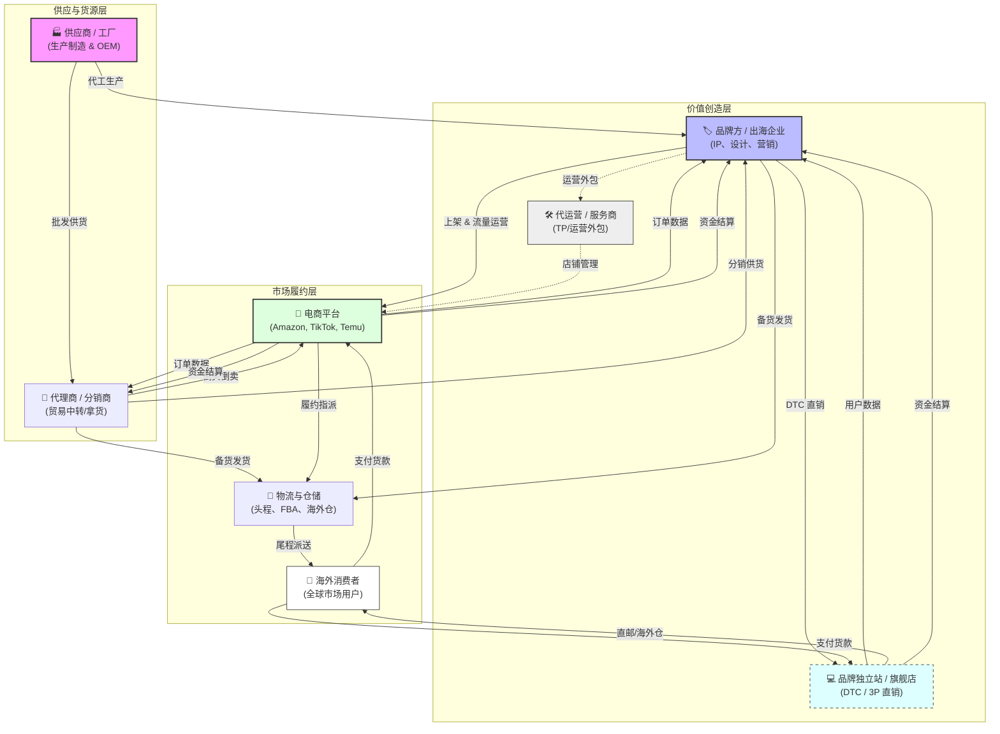
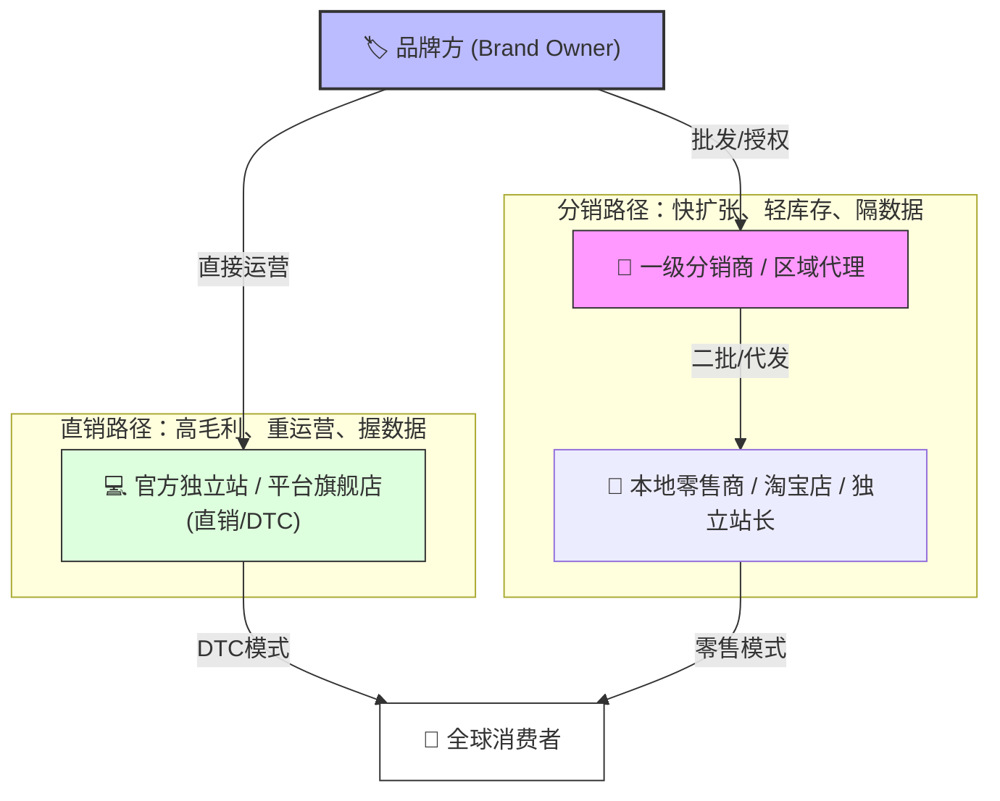
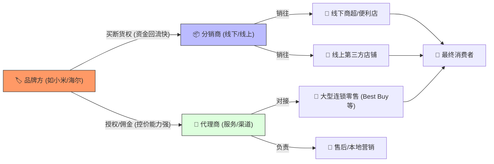
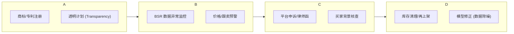

---
tags:
  - cbec
  - e-commerce
  - research
created: 2026-04-13
updated: 2026-04-13
---

# CBEC 跨境电商全链路痛点与权衡

> [!INFO] 研究背景
> 研究中国跨境电商（Cross-border E-commerce, CBEC）是一个非常深刻的切入点，尤其是目前行业正处于从"野蛮生长"向"精耕细作"转型的阶段。

要分析痛点，我们先梳理全链路的业务流程及其中的权衡取舍。

> [!NOTE] 术语说明
> 本文档涉及的术语定义请参考 [[CBEC_术语表]]。

## 1. 跨境电商的主要步骤

跨境电商的链路比国内电商长得多，主要可以分为以下六个核心阶段：

1. **选品与供应链 (Sourcing & Supply Chain)：** 确定卖什么，找谁生产。涉及产品研发、供应商筛选和起订量（[[MOQ]]）谈判。
2. **平台选择与店铺入驻 (Channel Selection)：** 决定是在亚马逊、TikTok Shop、Temu 等平台卖（3P/[[POP模式]]），还是供货给平台（1P/[[全托管模式]]），亦或是自建独立站（Shopify）。
3. **物流与仓储 (Logistics & Fulfillment)：** 货物如何从中国工厂到达海外消费者手中。包括头程运输、清关、海外仓储及尾程派送（[[FBA]]/[[FBM]]）。
4. **营销与流量运营 (Marketing & Operations)：** 获取流量。包括站内广告（[[PPC广告]]）、SEO、社交媒体红人营销（Influencer Marketing）及直播带货。
5. **支付与金融 (Payments & Finance)：** 涉及海外本币收款、结汇回国、退税以及资金周转的融资。
6. **合规与售后 (Compliance & After-sales)：** 处理退换货、海外税务（[[VAT]]）、知识产权（[[知识产权IP]]）保护及各类产品认证。

---

## 2. 每个步骤的 Trade-off 与选择

在实际操作中，没有"完美"的路径，只有根据自身资源（资金、技术、供应链能力）做出的权衡。

### A. 经营模式：[[全托管模式]] vs. [[POP模式]]

这是近两年中国跨境电商（如 Temu, AliExpress, TikTok）最核心的选择。

| 模式 | 优势 (Pros) | 劣势 (Cons) | 适合人群 |
| :--- | :--- | :--- | :--- |
| **[[全托管模式]]** | 卖家只需供货，门槛极低；物流和运营由平台负责。 | 失去定价权；品牌存在感弱；利润空间被极度压低。 | 有工厂资源、不擅长流量运营的传统制造商。 |
| **[[POP模式]] (3P/Marketplace)** | 掌握定价权和品牌控制力；直接接触消费者数据。 | 运营成本高；需要懂流量、懂物流、懂合规的专业团队。 | 有运营经验、追求品牌溢价的贸易商或品牌方。 |

### B. 物流履约：[[FBA]]/海外仓 vs. [[FBM]] (自发货)

物流是跨境电商中成本占比最高（通常达 20%-30%）的一环。

| 方案 | 权衡点 (Trade-offs) | 选择建议 |
| :--- | :--- | :--- |
| **海外仓/[[FBA]] (预备货)** | **优点：** 配送极快，用户体验好，权重高。<br>**缺点：** 资金压力大（囤货），有库存积压风险。 | 适合爆款、标准化产品、体积重适中的商品。 |
| **[[FBM]]/小包 (直邮)** | **优点：** 无需囤货，资金流转快，适合测品。<br>**缺点：** 时效慢（7-15天），转化率低，物流成本受航空运价波动大。 | 适合新品测试、定制化产品或客单价极高的垂直品类。 |

### C. 流量获取：[[PPC广告]] vs. 站外社媒

流量越来越贵是行业共识。

- **站内 ([[PPC广告]])：** 转化率高，意向明确，但竞争极度红海，[[ROI]]（投入产出比）不断下降。
- **站外 (TikTok/Instagram)：** 流量天花板高，有利于品牌建设。但链路长、转化率不稳定，对内容创作能力要求极高。

### D. 供应链策略：小批量快反 vs. 大批量压价

- **小规模快速反应 (如 SHEIN 模式)：** 每次只生产 100-500 件，根据市场反馈快速补货。**权衡：** 单件成本高，但库存风险极低。
- **大批量生产：** **权衡：** 单件成本极低，但一旦选品失败，库存就是灭顶之灾。

---

## 3. 跨境电商生态系统全图



> [!NOTE] 生态系统解读
> 整个跨境电商生态分为三层：**供应与货源层**（供应商、代理商）→ **价值创造层**（品牌方、代运营、**独立站/DTC**）→ **市场履约层**（平台、物流、消费者）。
>
> 图中新增了**品牌方直销路径**（蓝色虚线框）：
> - **品牌 → 平台 (3P/Seller Central)**：品牌自主运营店铺，掌握定价权和数据
> - **品牌 → 独立站 (DTC)**：品牌独立站直接触达消费者，数据完全自主
>
> 你正在研究的 [[BSR]] 数据属于**市场履约层**的核心指标。

---

## 4. 核心角色间的 Trade-offs

在进行痛点分析时，这几组关系是产生矛盾（及机会）的核心点：

### A. 供应商 (工厂) vs. 品牌方

| 角色 | 定位 | 核心诉求 |
| :--- | :--- | :--- |
| **供应商 (Muscle)** | 追求规模效应和生产稳定性 | 起订量（[[MOQ]]）管理、产能利用率 |
| **品牌方 (Brain)** | 追求溢价和用户数据 | R&D、营销、消费者洞察 |

**权衡点 (Trade-off): 重资产 vs. 灵活性**

- 自有工厂：控制力强但转型难
- 委外加工（OEM）：资产轻，但面临质量失控和供应商"跳单"风险

### B. 代理商 (贸易商) 的角色演变

在跨境早期，代理商靠信息差生存。在现在的"全托管"和"DTC"时代，纯贸易代理的空间被极度压缩。

**权衡点: 利润空间 vs. 运营难度**

- 做代理：赚辛苦钱（低毛利、高周转）
- 转做品牌：面临极高的前期营销投入成本

### C. 品牌方 vs. 代运营 (TP)

代运营 (TP)：提供专业的流量操盘能力。

**权衡点: 速度 vs. 核心竞争力**

- 找 [[TP代运营]] 可以快速起号出单
- 但品牌方会因此丢失运营深度和数据直触能力，且双方在利润分成和库存管理上往往存在博弈

### D. 平台 vs. 物流 (物理世界的瓶颈)

这是你最关注的数据领域（如 [[BSR]] 预测）。

**权衡点: 周转率 vs. 缺货率**

- 为了提高 [[BSR]]，必须保证不断货（大量压货到海外仓）
- 但大量压货意味着极高的资金占用和滞销风险
- **信息不对称是这里最大的痛点**

---

## 5. 直销 (DTC) vs. 分销 (Distribution)

在跨境电商的生态环境中，**直销 (Direct Sales)** 和**分销 (Distribution)** 代表了品牌方走向市场的两条完全不同的路径。

### 5.1 直销 vs. 分销的核心区别

在跨境语境下，**直销**通常等同于 **DTC (Direct-to-Consumer)**，而**分销**则涉及多层级的中间商。

| 维度 | 直销 (Direct Sales / DTC) | 分销 (Distribution) |
| :--- | :--- | :--- |
| **链路长度** | 品牌方 ➡️ 消费者 | 品牌方 ➡️ 分销商/代理商 ➡️ 零售商 ➡️ 消费者 |
| **利润率** | **高**（去中间化，掌握所有毛利） | **低**（需要给各级中间商留出利润空间） |
| **定价权** | 完全自主定价 | 品牌方建议零售价，但渠道商可能乱价 |
| **数据获取** | **直接掌握**（用户画像、购买行为） | **间接获取**（数据留在分销商手中，存在断层） |
| **库存风险** | **高**（品牌方承担所有压货风险） | **低**（风险由各级分销商分担） |
| **扩张速度** | 较慢（需要自己运营每个市场） | **极快**（利用分销商的本地资源快速铺货） |

### 5.2 整合后的生态图：直销 vs. 分销路径



### 5.3 跨境背景下的深度痛点分析

#### 直销的痛点：流量饥渴与转化率

- **痛点：** 因为没有分销商帮忙分担流量成本，品牌方必须亲自下场做 TikTok、Google 广告
- **数据挑战：** 获客成本（CAC）极高，如果不能通过**精准的销量预测**来优化库存，高昂的流量费加库存积压会迅速拖垮现金流

#### 分销的痛点：价格失控与数据断裂

- **痛点：** 分销商为了走量，可能会在 Amazon 上互相打价格战，毁掉品牌调性
- **数据挑战：** 品牌方不知道货最终卖给了谁，导致无法感知真实的终端需求。**这是你进行数据分析时最难处理的部分**——你看到的 [[BSR]] 可能是某个大分销商在清货，而不是真实的品牌流行度

### 5.4 1P vs. 3P 与直销/分销的对应关系

| 模式 | 链路 | 特征 |
| :--- | :--- | :--- |
| **1P (Vendor Central)** | 品牌 ➡️ Amazon (分销商) ➡️ 消费者 | 接近分销，BSR 仅作为监控渠道指标 |
| **3P (Seller Central)** | 品牌 ➡️ 消费者 | 接近直销，[[BSR]] 是生存命脉 |

> [!NOTE] 研究方向关联
>  [[BSR]] 预测，对于 **直销（3P）** 卖家来说代表流量和库存预期；而对于 **分销（1P）** 品牌来说，[[BSR]] 更多是作为监控渠道商(Amazon)表现的指标。

---

## 6. 初步透视：跨境电商的典型"痛点"

基于上述步骤，你可以发现几个后续值得深挖的痛点：

1. **库存错配：** 货在海上飘，销量突然跌；或者货卖爆了，补货跟不上（尤其是你正在研究的 **[[BSR]] 波动预测** 对此至关重要）。
2. **合规成本激增：** 欧洲 [[VAT]]、美国 [[EPR]] 环保要求、日益严格的[[知识产权IP]]封号风险。
3. **利润挤压：** 平台佣金 + 物流费 + 广告费，最后留给卖家的净利往往只有个位数。

> [!NOTE] 研究方向关联
> 你目前正在做的 Amazon 数据重构和 [[BSR]] 预测，本质上就是在解决**"物流与仓储"**阶段的**"库存管理与销量预测"**这一核心痛点。

---

## 7. 品牌出海路径对比：四种典型模式

这四个品牌代表了中国出海的四种典型路径：**快消品 (康师傅)**、**传统白电 (海尔)**、**垂直硬科技 (韶音)** 和**生态系统电子产品 (小米)**。

### 7.1 品牌对比矩阵

|**维度**|**康师傅 (FMCG)**|**海尔 (Home Appliances)**|**韶音 (Niche Tech)**|**小米 (Eco-system)**|
|---|---|---|---|---|
|**主要模式**|**“大宗批发 + 代理清关”模式**|**“本土化深耕 + 全球并购”模式**|**“DTC叙事 + 垂直场景渗透”模式**|**“生态链抱团 + 硬件入口”模式**|
|**运营深度**|**B2B2C：** 货权极早移交。依靠海外大分销商（如大华、99 Ranch）解决 FDA/食品合规及本地仓储，品牌方主要做大宗出口。|**Glocalization (全球本土化)：** 通过收购（如 GEA）直接获得当地成熟的售后、物流和线下网络。跨境电商（3P）仅作为触达年轻人的补充。|**DTC核心：** 极度依赖独立站（Shopify）沉淀私域数据，配合 Amazon 3P 承接搜索流量。线下走专业运动店（骑行、跑步店）而非大商超。|**“主舰 + 护卫舰”：** 以手机/手环为高频入口，带动手表中低频生态链产品。利用 Mi Home 建立品牌信任，通过 VC (1P) 快速铺量。|
|**流量来源**|**线下被动流量：** 依赖华人超市的自然进店客流，线上流量多为搜索品牌词产生的“刚需流量”。|**品牌口碑流量：** 依赖长期的本地广告和线下卖场展位，线上转化极其依赖用户评论（Reviews）。|**内容驱动流量：** 高度依赖社交媒体、红人（Influencers）和垂直社区（Strava 等）的口碑推荐。|**生态协同流量：** 利用米家 App、Mi UI 形成的系统级流量闭环，交叉销售（Cross-selling）效率极高。|
|**对 BSR 贡献**|**低：** 方便面这类产品在 Amazon 上的 BSR 波动往往是因为“断货”而非“竞争”。|**中：** BSR 是为了监控在大型家电类目下的相对地位，而非主要销售驱动。|**高：** BSR 直接代表了品牌在运动耳机这个垂直赛道的统治力。|**极高：** 每一款生态链产品都试图在各自类目（如扫地机）通过高性价比冲击 BSR 前 10。|

### 7.2 深度痛点分析

#### 康师傅：物流成本与合规的"极限运动"

> [!WARNING] 核心痛点
> 康师傅的出海更多是"胃的乡愁"，其核心痛点在于**单价与运费的极度不匹配**。

- **物流痛点：** 方便面体积大、易碎且单价极低。在跨境物流运费高涨时，运费可能超过货值，导致海外终端价格高昂，难以打入非华人主流市场
- **合规痛点：** 食品入境标准极其苛刻。不同国家对肉粉、添加剂、酱包成分的限制不同（如欧盟对环氧乙烷的检测），常因配方问题遭遇退运或销毁
- **库存痛点：** 保质期通常只有 6-12 个月，跨境海运加清关可能消耗 2-3 个月，留给货架的周转时间极短

#### 海尔：重资产下的"本地化长跑"

> [!WARNING] 核心痛点
> 海尔早已超越了简单的"跨境电商"，它面临的是**全球供应链协同**的痛点。

- **售后痛点：** 冰箱、洗衣机坏了不能"寄回中国维修"。海尔必须在海外建立极其昂贵的售后服务网点和零件库，这是大多数跨境卖家无法逾越的护城河，也是海尔最大的成本项
- **履约痛点：** 大件物流需要专门的卡车和入户安装服务，对海外本地仓储（3PL）的协同能力要求极高
- **标准痛点：** 各国电压、插头、能效等级标准不一，导致 SKU 极其分散，难以通过"一款爆品走天下"实现规模效应

#### 韶音 (Shokz)：垂直领域的"品牌堡垒"

> [!WARNING] 核心痛点
> 作为骨传导耳机的领跑者，韶音的痛点在于**"防守"与"教育"**。

- **市场教育痛点：** 骨传导是相对小众的技术，如何通过跨境营销让用户理解为什么它比传统耳机贵且好，是核心痛点
- **[[知识产权IP]] 痛点：** 韶音拥有核心专利，但跨境平台上大量低价"仿品"层出不穷。在全球范围内进行法律维权成本极高，且平台响应滞后
- **渠道冲突痛点：** 当韶音在海外进入 Best Buy 等线下零售渠道后，如何平衡线上独立站和线下代理商的价格体系，是典型的分销管理痛点

#### 小米：复杂生态下的"地缘政治"

> [!WARNING] 核心痛点
> 小米的痛点在于**"系统性风险"**。

- **地缘政治与数据痛点：** 作为智能硬件巨头，小米在印度、欧洲市场常面临数据隐私合规（GDPR）和政府监管的压力，甚至涉及关税壁垒
- **生态链管理痛点：** 小米出海不仅是手机，还有海量的生态链产品（石头扫地机、米家灯具）。不同生态链企业的出海步调、品牌授权和售后政策不一，导致品牌形象在海外有时存在割裂
- **利润挤压痛点：** 小米主打高性价比，在跨境广告费（CAC）和运费上升时，极其微薄的硬件毛利极易被吞噬

### 7.3 品牌跨境痛点雷达图

```chart
type: radar
width: 20%
labels: [物流复杂性, 售后成本, 合规压力, 品牌教育, 政策风险, 资金压力]
series:
  - title: 康师傅
    data: [5, 1, 5, 2, 2, 3]
  - title: 海尔
    data: [5, 5, 3, 2, 3, 5]
  - title: 韶音
    data: [2, 2, 3, 5, 2, 3]
  - title: 小米
    data: [3, 3, 4, 3, 5, 4]
options:
  scales:
    r:
      suggestedMin: 0
      suggestedMax: 1
```

> [!NOTE] 数值说明
> 数值越高代表该项痛点越严重（1-5 分制）

### 7.4 BSR 波动特征与品牌对应关系

| 品牌类型 | BSR 波动特征 | 驱动因素 | 数据挑战 |
| :--- | :--- | :--- | :--- |
| **康师傅类** | 强季节性 | 节日（春节）、物流到港节奏 | 物流节奏影响数据归因 |
| **海尔类** | 相对稳定，断崖式下跌 | 大面积售后投诉、竞品价格战 | 售后事件难以提前预测 |
| **韶音类** | 脉冲式 | 红人推广、新品发布周期 | 外部推广活动难以量化 |
| **小米类** | 高敏感度 | 竞品活动、Black Friday、大促 | 替代性强，促销敏感 |

---

## 8. 分销商 vs. 代理商：两个被混用的角色

**分销商像"搬运工+小老板"**（买断货、背库存、赚差价）；**代理商像"品牌替身"**（代行职责、管渠道、抽佣金或赚价差）。

### 8.1 核心职能区别

| 维度       | 分销商 (Distributor)           | 代理商 (Agent/Representative)     |
| :------- | :-------------------------- | :----------------------------- |
| **货权归属** | **买断制**。货权从品牌方转移给分销商。       | **代售/授权制**。货权可能仍在品牌方，或受品牌严格控价。 |
| **核心任务** | **铺货 & 周转**。利用自己的仓库和车队把货卖掉。 | **品牌维护 & 渠道管理**。代表品牌去谈商超、做营销。  |
| **利润来源** | **进销差价**（低买高卖）。             | **佣金 (Commission)** 或品牌返利。     |
| **风险承担** | **高**。卖不掉就是自己的库存积压。         | **低**。主要承担运营成本，不一定背负库存。        |

### 8.2 四大品牌的分销/代理策略

#### 康师傅：线下为王，分销商是"毛细血管"

- **渠道：** **90% 以上是线下**（海外华人超市、中餐馆、加油站便利店）
- **分销商（线下）：** 康师傅在海外通常找"大批发商"，拥有本地冷链或干仓，负责把方便面送进 99 Ranch Market（大华超市）或 H-Mart
- **痛点解决：** 解决了**"最后一公里"的配送**和**本地商超进场费**的问题

#### 海尔：线下深度分销 + 线上专业代理

- **渠道：** **线下为主（家电卖场），线上为辅**
- **代理商（线下）：** 海尔找区域总代去谈 Best Buy、Lowe's 等大型连锁店。代理商负责建立**售后维修网点**，这是家电出海的命脉
- **分销商（线上）：** 在 Amazon 等平台，海尔授权给特定专业卖家（电商代理），由他们负责页面视觉、客服和 FBA 入库

#### 韶音 (Shokz)：线上 DTC + 线下专业垂直代理

- **渠道：** **线上线下并重**
- **代理商（线下垂直）：** 韶音依赖**专业场景代理**，如跑步装备店、自行车行。代理商不仅卖货，还要**组织试穿、赞助马拉松**
- **线上运营（代理/TP）：** 韶音在海外有很强的独立站，通常是自己运营或找高端 TP

#### 小米：复杂的生态链代理体系

- **渠道：** **全渠道**
- **分销商（线上/线下混合）：** 小米在很多国家有"国家代理"，既开线下 Mi Home 门店，又供货给当地电信运营商（如沃达丰、Orange）
- **痛点解决：** 小米产品线太杂，分销商帮小米分担了**不同品类的准入认证**费用和库存压力

### 8.3 品牌与分销/代理协作逻辑图



### 8.4 分销/代理模式的核心痛点

| 痛点 | 描述 | 典型品牌 |
| :--- | :--- | :--- |
| **价格乱战** | 多个分销商在 Amazon 上互相杀价，导致全球价格体系崩盘 | 小米、韶音 |
| **数据黑盒** | 分销商不愿分享客户数据，品牌方无法洞察真实消费者画像 | 康师傅 |
| **服务掉链子** | 代理商承诺的售后没做到，用户在 Google Review 上骂的是品牌方 | 海尔 |

### 8.5 跟卖 (Hijacking) 与分销商窜货

> [!WARNING] 数据干扰警告
> 在你的 [[BSR]] 预测模型中，需要考虑**"跟卖（Hijackers）"**现象。很多时候，这些跟卖者其实是该品牌在其他地区的**分销商**跨区域窜货。这会极大地干扰销量预测数据。

- **跟卖机制：** 分销商在不同地区有不同拿货价，跨区窜货到 Amazon 上销售
- **BSR 干扰：** 窜货导致的销量波动并非真实市场需求，可能被误判为市场热度的变化
- **识别信号：** 如果某 ASIN 的 BSR 突然波动，但 reviews 增长与排名变化不匹配，可能是窜货导致

### 8.6 跟卖货源的"五个隐秘角落"

| 货源类型 | 货的真假 | 来源渠道 | 对品牌方的核心痛点 |
| :--- | :--- | :--- | :--- |
| **[[零售套利]]** | 真品 | 零售店促销/电商差价 | 价格体系紊乱，由于是正品，投诉很难成功 |
| **[[串货]]** | 真品 | 其他地区的非授权代理 | 扰乱全球定价逻辑，引发各区代理商内斗 |
| **[[代工厂尾货]]** | 接近真品 | 代工厂私自外流 | 严重侵犯知识产权，且品牌方难以自查 |
| **假货** | 假货 | 低端仿制厂 | **致命伤**：引发大量退款和差评风险 |
| **[[清算库存]]** | 真品 | 破产/清仓物资 | 不受控的低价抛售，短期冲击 [[BSR]] |

#### ① 零售套利 (Retail Arbitrage)

- **逻辑：** 趁低价买入，在高价市场卖出
- **货哪来的？** 清仓大促（沃尔玛、Target 黑五）、平台差价（拼多多/Temu）
- **特点：** 量小，但会**瞬间拉低价格**，扰乱 [[BSR]] 稳定性

#### ② 串货与二级分销 (Gray Market)

- **逻辑：** 品牌方的地区价格歧视
- **货哪来的？** 中国区代理 100 元拿货，偷偷发往美国以 130 元跟卖美区旗舰店（美国区代理拿货价 150 元）
- **特点：** **绝对正品**，但没有品牌方的海外授权

#### ③ "后门货"与代工厂背叛 (Factory Backdoor)

- **逻辑：** 品牌方下单 10,000 件，工厂私下多做了 1,000 件
- **货哪来的？** 影子工厂（深夜班次生产）、次品/尾货偷偷倒卖
- **特点：** 和正品几乎一模一样，连包装都难辨真假

#### ④ 假货与空包 (Counterfeits)

- **逻辑：** 挂羊头卖狗肉
- **货哪来的？** 生产外形相似或完全一致的假货；或发空包/石头快速收割
- **特点：** 极短时间内产生大量**差评 (Negative Reviews)**，直接毁掉 Listing

#### ⑤ 库存清理与"洋垃圾" (Liquidation)

- **逻辑：** 捡漏大王
- **货哪来的？** 线下连锁店倒闭、代理商破产清算，库存被低价打包出售给跟卖者
- **特点：** 不受控的低价抛售，短期冲击 [[BSR]]

> [!NOTE] Amazon 底层逻辑
> Amazon 的底层逻辑是**"保护消费者利益（低价优先）"**。只要对方能证明货是从合法渠道买来的正品，Amazon 通常认为跟卖合法。大品牌必须推行 Transparency（透明计划）和 Brand Registry。

> [!TIP] 数据建模建议
> 如果某个 ASIN 的 [[BSR]] 突然暴涨，但价格跌破品牌方官限价，那大概率是**大规模跟卖**入场。建议在 BSR 预测模型中加入 **"Price Deviation"（价格偏离度）** 因子。

---

## 9. 五种致命市场行为与防御策略

### 9.1 恶意点击 (Click Fraud)

| 维度 | 说明 |
| :--- | :--- |
| **行为** | 竞争对手利用 Bot 或"点击公司"，疯狂点击你的关键词广告 |
| **痛苦点** | 广告预算几小时内烧光，无转化；平台算法降低你的自然搜索排名 |
| **解决方案** | 广告防欺诈工具、分时段竞价躲避危险时段、平台申诉返还广告费 |

### 9.2 刷单与恶意差评攻击 (Brushing & Review Sabotage)

| 维度 | 说明 |
| :--- | :--- |
| **行为** | 竞争对手恶意刷入大量假评论，或针对爆款留大量 1 星评价并点赞置顶 |
| **痛苦点** | 触发平台风控封号；转化率暴跌 |
| **解决方案** | 加入 [[Amazon_Vine]] 计划、监控评论增长曲线异常、通过 Brand Registry 获得评论管理权限 |

### 9.3 "僵尸"变体合并 (Variation Hijacking / Review Merging)

| 维度 | 说明 |
| :--- | :--- |
| **行为** | 竞争对手将已停产的"僵尸 Listing"合并到自己的新产品下 |
| **痛苦点** | 对手瞬间拥有数千条高分评价，BSR 实现"弯道超车" |
| **解决方案** | 举报类目不符 (Category Mismatch)、使用 Keepa/Helium 10 监控变体数目异常 |

### 9.4 专利/版权流氓 (IP Trolling)

| 维度 | 说明 |
| :--- | :--- |
| **行为** | 对方恶意抢注产品外观设计、品牌名称，发起侵权投诉 |
| **痛苦点** | 爆款瞬间被下架，申诉周期数周至数月，销量和排名损失毁灭性 |
| **解决方案** | 出海前完成商标/外观专利注册、建立知识产权库并平台备案、准备律师函反向投诉 |

### 9.5 恶意退货与换货欺诈 (Return Fraud / Parts Swapping)

| 维度 | 说明 |
| :--- | :--- |
| **行为** | 消费者或竞争对手伪装购买，退回坏掉的旧机器、石头，或拆走核心零件 |
| **痛苦点** | 品牌方损失货值 + 退货运费 + 平台处理费 |
| **解决方案** | [[透明计划]] 每件货贴加密二维码、要求 FBA 退回库存强制检查、建立高风险客户黑名单 |

### 9.6 品牌防御闭环 (Brand Defense Loop)



### 9.7 BSR 异常值检测清单

> [!TIP] 数据建模建议
> 当 [[BSR]] 突然莫名升高，但价格无变动、也无节日因素时，可从以下维度回溯：

| 检测维度 | 怀疑问题 |
| :--- | :--- |
| **评价总数 (Review Count) 短期暴增？** | 变体合并/刷单 |
| **卖家数量 (Sellers Count) 在增加？** | 跟卖/串货 |
| **广告位排位 (Ad Rank) 下滑但转化率暴跌？** | 恶意点击 |

---

## 10. 代理问题 (Agency Problem)：品牌方 vs. 代理/分销商

品牌方与代理/分销商之间的关系，本质上是一场关于**利润、控制权和信息**的博弈。

### 10.1 品牌方与代理商的五大核心矛盾

#### 🚩 信息黑盒 (The Data Wall)

- **矛盾：** 代理商掌握着最终消费者的画像、购买习惯和反馈，但往往不愿与品牌方共享
- **后果：** 品牌方成了"瞎子"，无法根据市场反馈快速迭代产品。在研究 [[BSR]] 预测时会发现：如果数据只来自代理商的批量订货单，无法感知终端市场的真实冷暖

#### 🚩 价格体系与"窜货" (Price & Channel Conflict)

- **矛盾：** 品牌方追求长期品牌溢价，代理商追求短期现金流，倾向于打折
- **后果：** 代理商将货物私自卖往非授权区域，导致全球价格体系崩盘，引发各区域代理"内斗"

#### 🚩 利益错位 (Misalignment of Goals)

- **矛盾：** 品牌方要"品牌心智"，代理商要"搬砖利润"
- **后果：** 产品好卖时代理商不投入品牌维护；产品难卖时迅速弃船

#### 🚩 库存博弈 (The Bullwhip Effect)

- **矛盾：** 代理商旺季前过度囤货（导致品牌方误判需求），或淡季极度保守（导致终端断货）
- **后果：** "牛鞭效应"被逐级放大，造成品牌方生产线剧烈波动

#### 🚩 售后与服务"甩锅" (Service Dissatisfaction)

- **矛盾：** 代理商希望品牌方承担一切售后成本，品牌方认为这是代理商本地化服务的一部分
- **后果：** 用户问题得不到解决，亚马逊上的 1 星差评是给"品牌"的

### 10.2 品牌方转向 DTC 的三大动因

#### 💰 利润空间的重构 (Margin Capture)

去掉中间商，原本分给代理商的 **15%-30%** 的利润重新分配：一部分变成品牌方净利润，一部分变成更有竞争力的终端价格，一部分投入到流量研发。

#### 📈 数据驱动的决策 (Data Loop)

| 数据维度 | DTC 可获取 | 代理商模式 |
| :--- | :--- | :--- |
| **流量来源** | ✓ 完整 | ✗ 缺失 |
| **转化细节** | ✓ 完整 | ✗ 缺失 |
| **用户画像** | ✓ 完整 | ✗ 被截留 |
| **预测精度** | ✓ 高 | ✗ 低 |

#### 🛡️ 品牌控制力的回归 (Brand Governance)

- **视觉统一：** 页面排版、卖点讲述方式，品牌方说了算
- **危机处理：** 遇到跟卖或差评攻击，可直接下场处理

### 10.3 代理冲突图

```mermaid
graph TD
    Brand["🏷️ 品牌方 (追求溢价/数据)"]
    Agent["🤝 代理商 (追求销量/差价)"]
    Consumer["👤 消费者"]

    Brand -- "控制价格" x-- x Agent
    Brand -- "要求分享数据" x-- x Agent

    Brand -- "DTC 模式 (独立站/3P)" --> Consumer

    Agent -- "阻断信息回流" --> Brand
    Agent -- "杀价获客" --> Consumer

    style Brand fill:#f96,stroke:#333
    style Agent fill:#bbf,stroke:#333
    style Consumer fill:#dfd,stroke:#333
```

### 10.4 混合模式：当前的终点

目前最先进的模式是 **"混合型架构"**：

| 渠道 | 核心目的 |
| :--- | :--- |
| **线上直售 (DTC)** | 抓取数据 + 建立价格标杆 |
| **线下分销** | 利用物流网络和客情关系，解决本地化配送和售后 |

### 10.5 数据权重建议

> [!QUESTION] 思考问题
> 在你的 [[BSR]] 预测实践中，如果一个 ASIN 下既有品牌方直营（3P），又有大分销商（1P），你认为哪一类数据的权重应该设得更高？

| 数据来源 | 权重建议 | 理由 |
| :--- | :--- | :--- |
| **3P 直营数据** | **更高** | 真实反映市场需求，无窜货干扰 |
| **1P 分销数据** | 参考 | 可能包含渠道泡沫，需除噪 |

---

## Connections

- [[CBEC_术语表]] — 统一术语定义
- [[Amazon_BSR_预测研究]] — 当前研究方向，解决库存错配痛点
- [[CBEC_平台模式对比]] — 待延伸：Temu/AliExpress/TikTok Shop 详细分析
- [[CBEC_物流履约方案]] — 待延伸：FBA/海外仓/自发货深度对比
